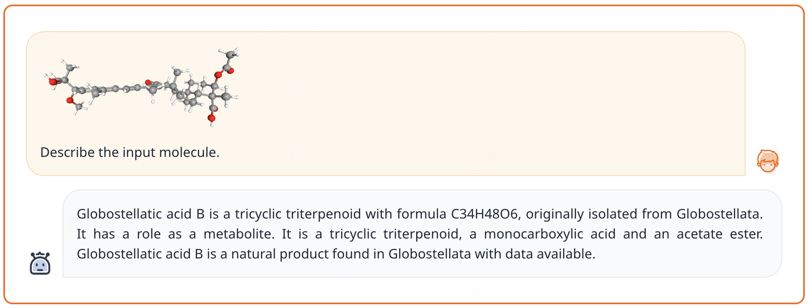
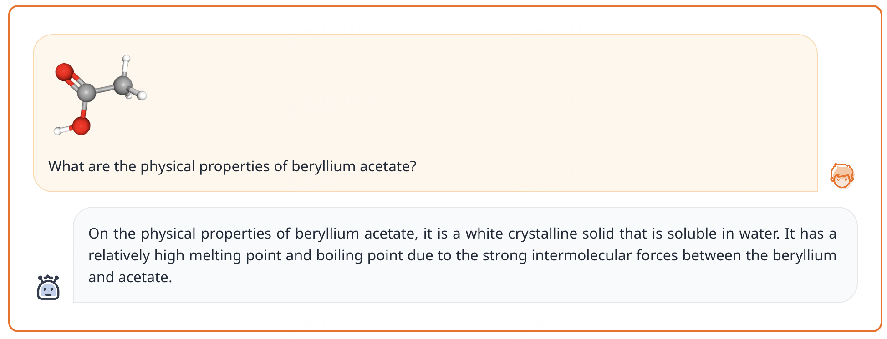
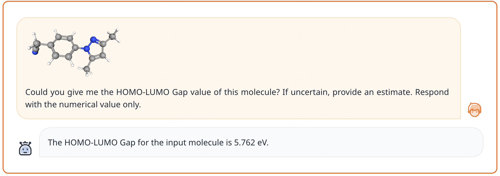

# 3D-MoLM: Towards 3D Molecule-Text Interpretation in Language Models

Codes of our ICLR'24 paper. [[Paper Link](https://arxiv.org/abs/2401.13923)], [[Website](https://lsh0520.github.io/3D-MoLM/)], [[Demo]()]

Authors: Sihang Li*, Zhiyuan Liu*, Yanchen Luo, Xiang Wang†, Xiangnan He†, Kenji Kawaguchi, Tat-Seng Chua, Qi Tian

\* Equal Contribution    

<!-- &nbsp;&nbsp;&nbsp;&nbsp;&nbsp;&nbsp;&nbsp;&nbsp;   -->

† Corresponding

## Framework

<p align="center">
  
</p>

* 3D-MoLM is a **versatile** molecular LM that can be applied for molecule-text retrieval, molecule captioning, and molecule question-answering tasks.
* 3D-MoLM employs a 3D molecule-text **projector** to bridge the modality gap between a 3D molecular encoder and an LM, enabling the LM to **perceive 3D molecular structures**.

## Training pipeline

<p align="center">
  
</p>

To tackle the two challenges of **3D molecule-text alignment** and **3D molecule-centric instruction tuning**, we delineate a three-stage training pipeline for 3D-MoLM, including 1) 3D molecule-text representation learning, 2) 3D molecule-text alignment via text generation, and 3) instruction-based fine-tuning.

### 3D Molecule-Text Alignment

3D Molecule-Text Alignment maps 3D molecular representations into the input textual space where the LM can understand.

* **Data Preparation – PubChem.** We collect molecular SMILES-text pairs from PubChem, and further employ GPT-3.5 to enrich the less annotated molecular descriptions. Molecular 3D conformations are obtained by running the MMFF algorithm in RDKit. As a result, 316K 3D molecule-text pairs are obtained for the alignment pretraining and downstream tasks of molecule-text retrieval and molecule captioning.
* **Stage 1: 3D Molecule-Text Representation Learning** cultivates Q-Former’s ability to extract molecular features that resonate profoundly with the corresponding text
* **Stage 2: 3D Molecule-Text Alignment via Generative Learning** connect the Q-Former with the LM to leverage the LM’s language generation capability, where the molecular representations extracted by the Q-Former serve as 1D soft prompts comprehensible to the LM.

### 3D Molecule-centric Instruction Tuning

3D Molecule-centric Instruction Tuning fine-tunes the model to follow human instructions on 3D molecule relevant tasks.

* **Data Preparation – 3D-MoIT.** We construct 3D-MoIT by sourcing data from the PubChem and PubChemQC databases, including both computed molecular properties and descriptive texts that characterize molecule properties in numerical values and free texts, respectively.
* **Stage 3: Instruction-based Fine-tuning** enhances the ability to follow various instructions and improves the understanding of 3D molecular structures, especially in recognizing 3D-dependent properties

## Demonstration

### Molecule Captioning

<p align="left">
  
</p>

### Open-text QA

<p align="left">
  
</p>

### Computed Property QA

<p align="left">
  
</p>

## Requirements

See `requirements.txt`. Run the following command to create a new anaconda environment `3D-MoLM`:

```bash
pip install -r requirements.txt
```

## Dataset

* **3D-MoIT**. Download the dataset from [Huggingface-3D-MoIT](https://huggingface.co/datasets/Sihangli/3D-MoIT), and put it under the `./data/` directory.

## Checkpoints

* **3D-MoLM**. Download the LoRA checkpoints from [Huggingface-3D-MoLM](https://huggingface.co/Sihangli/3D-MoLM), and put it under the `./all_checkpoints/` directory.
* **Uni-Mol**. Download the checkpoint from [Huggingface-Uni-Mol](https://huggingface.co/Sihangli/3D-MoLM), and put it under the `./all_checkpoints/` directory.
* **SciBERT**. Download the checkpoint from [Huggingface-scibert](https://huggingface.co/allenai/scibert_scivocab_uncased), and put it under the `./all_checkpoints/` directory.
* **Llama2-7B**. Download the checkpoint from [Huggingface-Llama](https://huggingface.co/meta-llama/Llama-2-7b-hf), and put it under the `./all_checkpoints/` directory.

## Reproduce the results

### Prerequisites

* Install required conda environment as described in **Requirements** section
* Download the dataset and required checkpoints as described in **Dataset** and **Checkpoints** section.

### Directly Read the Outputs

We provide the outputs of 3D-MoLM on the test set of 3D-MoIT in `all_checkpoints/generalist/lightning_logs/version_0/predictions.txt`. Run the following script to read it.

```bash
python read_generalist_results.py 
    --file_path 'all_checkpoints/generalist/lightning_logs/version_0/predictions.txt' 
    --tokenizer_path 'all_checkpoints/llama-2-7b-hf'
```

### Evaluation on Our Pretrained Checkpoint

We share the checkpoint for reproducing results.

```bash
bash ./scripts/stage3_test.sh
```

### Training the Model from Scratch

**Stage 1: 3D Molecule-Text Representation Learning**

Run the following script for stage 1 pretraining:

```bash
bash ./scripts/stage1_pretrain.sh
```

**Stage 2: 3D Molecule-Text Alignment via Generative Learning**

Run the following script for stage 2 pretraining:

```bash
bash ./scripts/stage2_pretrain.sh
```

**Stage 3: Instruction-based Fine-tuning**

Run the following script for instruction tuning:

```bash
bash ./scripts/stage3_train.sh
```

## Citation

If you use our codes or checkpoints, please cite our paper:

```bib
@inproceedings{li2024molm,
    title={3D-MoLM: Towards 3D Molecule-Text Interpretation in Language Models},
    author={Li, Sihang and Liu, Zhiyuan and Luo, Yanchen and Wang, Xiang and He, Xiangnan and Kawaguchi, Kenji  and Chua, Tat-Seng and Tian, Qi},
    booktitle={ICLR},
    year={2024},
    url={https://openreview.net/forum?id=xI4yNlkaqh}
}
```
